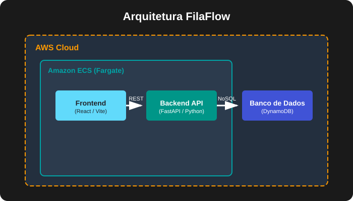

# FilaFlow - Gerenciamento Inteligente de Filamentos 3D

Sistema completo para controle de inventário de insumos de impressão 3D, permitindo catalogar cores, materiais e gerenciar o estoque de carretéis (como Tecnocubo 3D, 3D Lab) para impressoras desktop (como a Creality K1C).

## Arquitetura do Sistema e Fluxo de Dados

O FilaFlow é construído sobre uma stack moderna e escalável, dividida nos seguintes componentes principais:

- **Frontend:** Desenvolvido com **React** e empacotado pelo **Vite**, entregando uma interface de usuário ultrarrápida e responsiva.
- **Backend:** Uma API REST robusta construída em Python utilizando o framework **FastAPI**, oferecendo alta performance e autogeração de documentação nativa (Swagger/Redoc).
- **Banco de Dados:** Utiliza **Amazon DynamoDB**, um banco de dados NoSQL gerenciado de alta performance, ideal para gerenciar o estado e inventário dos filamentos.

### Fluxo de Dados do Sistema

O diagrama abaixo ilustra como os componentes do FilaFlow se comunicam na infraestrutura AWS Fargate:


## Infraestrutura e Provisionamento (Terraform)

Toda a infraestrutura em nuvem na AWS foi provisionada seguindo estritamente o paradigma de **Infrastructure as Code (IaC)**, utilizando **Terraform**. Isso garante um ambiente previsível, versionado e facilmente replicável.

Os principais recursos gerenciados pelo Terraform incluem:
- **Rede:** Criação de VPC (Virtual Private Cloud) customizada, com segmentação em Subnets públicas e privadas.
- **Segurança:** Configuração rigorosa de Security Groups limitando o tráfego apenas ao necessário.
- **Containers e Orquestração:** Repositórios no Amazon ECR (Elastic Container Registry) para armazenamento de imagens Docker e um cluster Amazon ECS rodando tarefas no modelo *Serverless* com **AWS Fargate**, eliminando a necessidade de gerenciar instâncias de servidores virtuais.

## Como Rodar Localmente

A forma mais simples de executar todo o ecossistema localmente (API + Banco Mock + Frontend) é utilizando **Docker Compose**.

1. **Clone o repositório:**
   ```bash
   git clone https://github.com/matheuzfz/FilaFlow.git
   cd FilaFlow
   ```

2. **Configure as Variáveis de Ambiente:**
   Crie arquivos `.env` nos diretórios `frontend/` e `backend/` baseando-se nos arquivos `.env.example` fornecidos.

3. **Inicie os Containers:**
   Na raiz do projeto, execute o comando:
   ```bash
   docker-compose up -d --build
   ```

Após o build, a aplicação estará disponível em:
- **Frontend:** [http://localhost:5173](http://localhost:5173)
- **Backend API:** [http://localhost:8000](http://localhost:8000)
- **Documentação da API:** [http://localhost:8000/docs](http://localhost:8000/docs)

*(Alternativamente, é possível rodar `npm run dev` na pasta `frontend` e `uvicorn main:app --reload` na pasta `backend` se possuir os ambientes Node e Python configurados localmente).*

## CI/CD (Integração e Entrega Contínuas)

O ciclo de vida do desenvolvimento é assegurado por uma esteira automatizada no **GitHub Actions**. O fluxo da pipeline consiste em:

- **Build e Testes:** Executa o *linting* de código e valida a integridade do sistema.
- **Construção de Imagens:** Realiza o build automatizado das imagens Docker para o Frontend e Backend.
- **Deploy (Continuous Deployment):** Caso seja um push para a *branch* principal, a pipeline realiza o push condicional das novas imagens para os repositórios do Amazon ECR. Em seguida, aciona o recarregamento (Rolling Update) das *tasks* no ECS Fargate para adotar a nova versão da aplicação sem indisponibilidade.

---

## Changelog

*O histórico de versões e modificações mais importantes da aplicação.*

### [1.0.2] - 2026-08-15
- **Adicionado:** Configuração final de CORS no backend e injeção estática da URL de produção via Dockerfile (build-arg) para eliminar a dependência de localhost no frontend empacotado pelo Vite.
